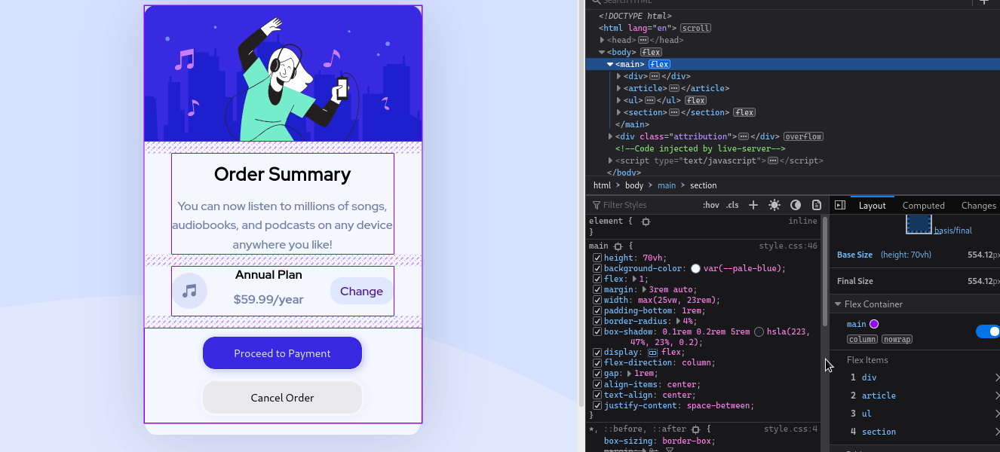

# Frontend Mentor - Order summary card solution

This is a solution to the [Order summary card challenge on Frontend Mentor](https://www.frontendmentor.io/challenges/order-summary-component-QlPmajDUj). Frontend Mentor challenges help you improve your coding skills by building realistic projects.

---

screenshot

---


---

preview

---



## Table of contents

- [Frontend Mentor - Order summary card solution](#frontend-mentor---order-summary-card-solution)
  - [Table of contents](#table-of-contents)
  - [Overview](#overview)
    - [The challenge](#the-challenge)
    - [Screenshot](#screenshot)
    - [Links](#links)
  - [My process](#my-process)
    - [Built with](#built-with)
    - [What I learned](#what-i-learned)
    - [Continued development](#continued-development)
    - [Useful resources](#useful-resources)
  - [Author](#author)

## Overview

this is the solution that I came up width,

### The challenge

Users should be able to:

- See hover states for interactive elements

### Screenshot


### Links

- Live Site URL: [order-summary-commponent-delta](https://order-summary-commponent-delta.vercel.app/)
- Solution URL:[Github ](https://github.com/imadbg01/order-summary-commponent)

## My process

### Built with

- Semantic HTML5 markup
- CSS custom properties
- Flexbox
- Mobile-first workflow

### What I learned

I learned that refactoring it's important for better solutions.

I learned that html is for structure and I need to ignore default styles that came with browser, in that in mind I forced myself to write more semantic elements and let look and feel to css and javascript.

I ALSO Notice that I experienced some struggling to find name for classes. as author garbage solution I get to use CSS selectors to manipulate elements, it's add some complexity, but I gave it a try .

```html
<ul>
  <li><a href="#"></a></li>
  <li><a href="#"></a></li>
  <li><a href="#"></a></li>
</ul>
```

```css
ul > li:nth-child(1) a {
  color: var(--Some-Color);
}
ul > li:nth-child(2) a {
  color: var(--Some-Color);
}
ul > li:nth-child(3) a {
  color: var(--Some-Color);
}
```

### Continued development

Use this section to outline areas that you want to continue focusing on in future projects. These could be concepts you're still not completely comfortable with or techniques you found useful that you want to refine and perfect.

**Note: Delete this note and the content within this section and replace with your own plans for continued development.**

### Useful resources

- [MDN](https://developer.mozilla.org/en-US/docs/Web/CSS/border-radius) - This helped me understand **border-radius**.

## Author

- Website - [imad bg](https://www.github.com/imadbg01)
- Frontend Mentor - [@imadbg01](https://www.frontendmentor.io/profile/imadbg01)
- Twitter - [@imadBg4](https://twitter.com/ImadBg4)
